# Instalación de Zabbix en Ubuntu 18.04.

1. En una maquina con Ubuntu 18.04 instalado descargamos zabbix con el siguiente comando y lo instalamos:

```bash
wget https://repo.zabbix.com/zabbix/4.2/ubuntu/pool/main/z/zabbix-release/zabbix-release_4.2-1+bionic_all.deb 
```

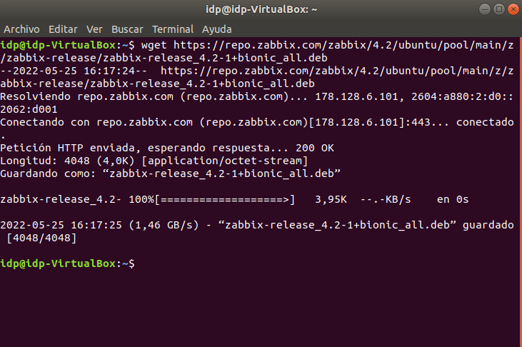

```bash
sudo dpkg -i zabbix-release_4.2-1+bionic_all.deb 
```

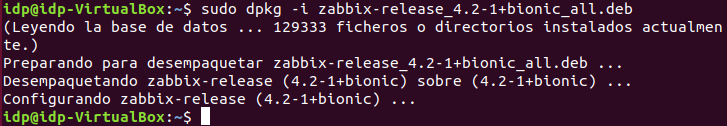

2. Actualizamos los repositorios e instalamos el resto de paquetes necesarios para el servidor zabbix(esto último tardara un rato):

```bash
sudo apt update
```


```bash
sudo apt install -y zabbix-server-mysql zabbix-frontend-php zabbix-agent
```

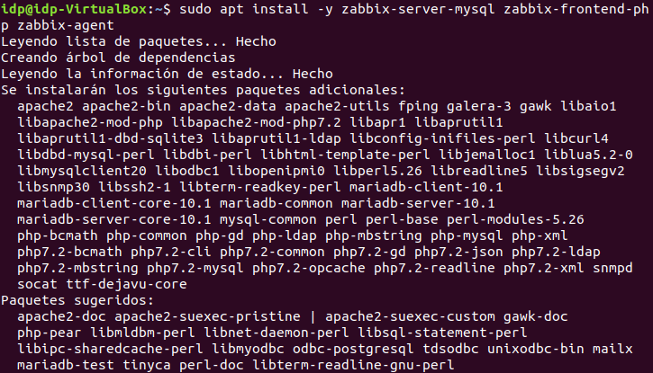

3. Conectamos al servidor de bases de datos y creamos la base de datos:

```bash
sudo mysql -uroot -p
```

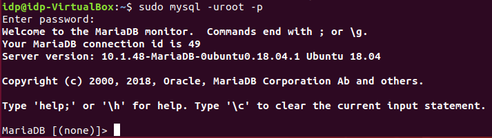

4. Creamos el usuario con su contraseña y le damos todos los privilegios sobre la base de datos:

```sql
	create database zabbix character set utf8 collate utf8_bin;
```

```sql
	grant all privileges on zabbix.* to zabbix@localhost identified by 'password';
```

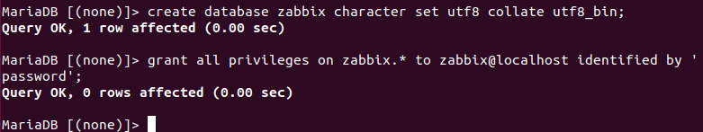

5. Ahora importamos los datos de la base de datos con la misma contraseña que creamos antes:

```bash
zcat /usr/share/doc/zabbix-server-mysql*/create.sql.gz | mysql -uzabbix -p zabbix
```

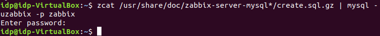

6. Editamos el fichero /etc/zabbix/zabbix_server.conf para añadir lo siguiente: 

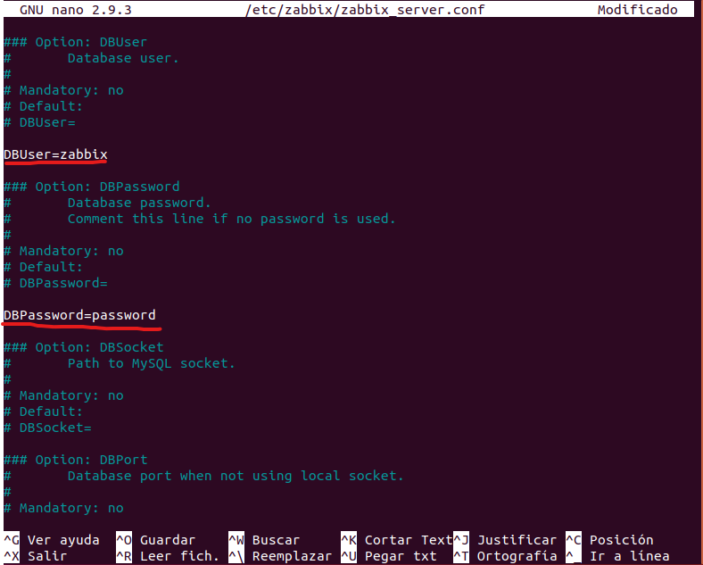

7. También editaremos el fichero /etc/zabbix/apache.conf, donde especificaremos la zona horaria:

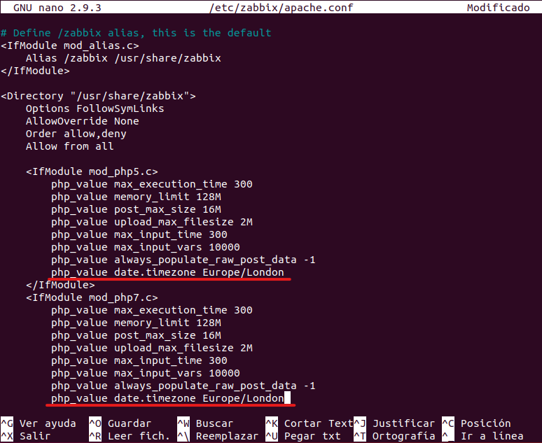

8. Ahora reiniciamos el servidor:

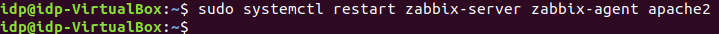

10. Configuramos el zabbix para que se inicia automáticamente cuando se arranque el equipo:

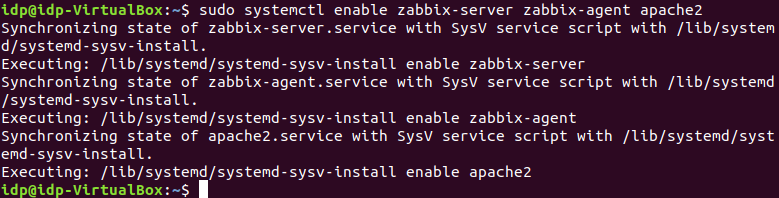

11. Ahora ya tendríamos zabbix instalado, para administrarlo abrimos el navegador y buscamos localhost/zabbix:

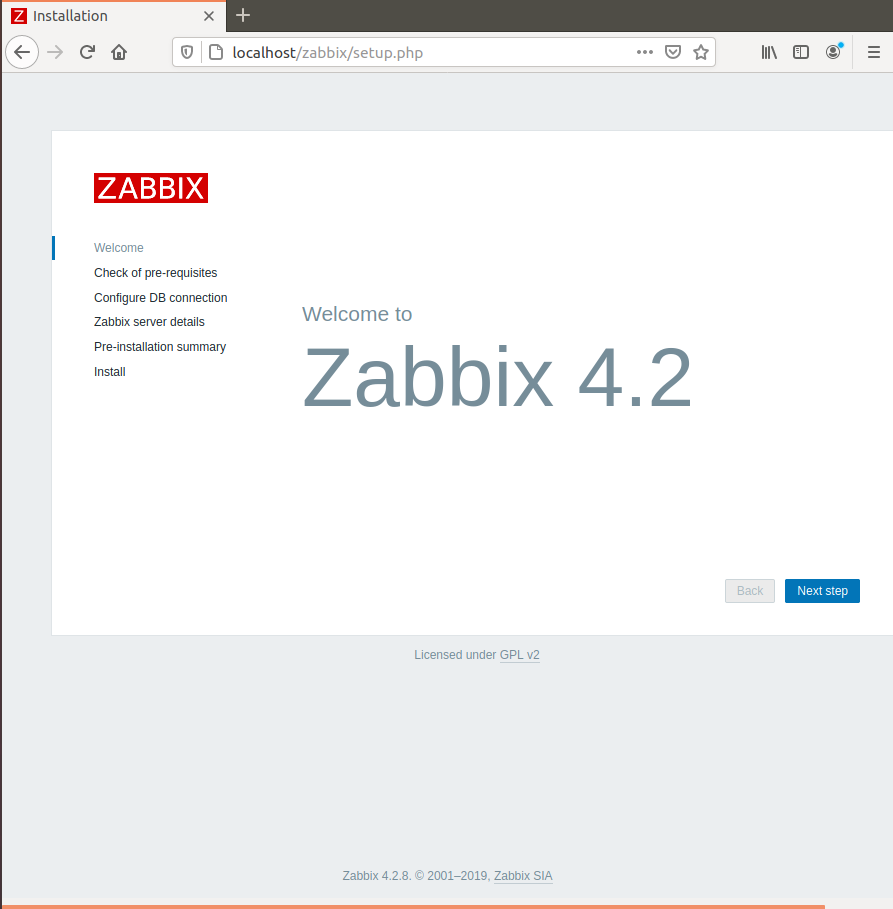

12. Si se ha instalado todo correctamente todos los requisitos deberían estar en verde:

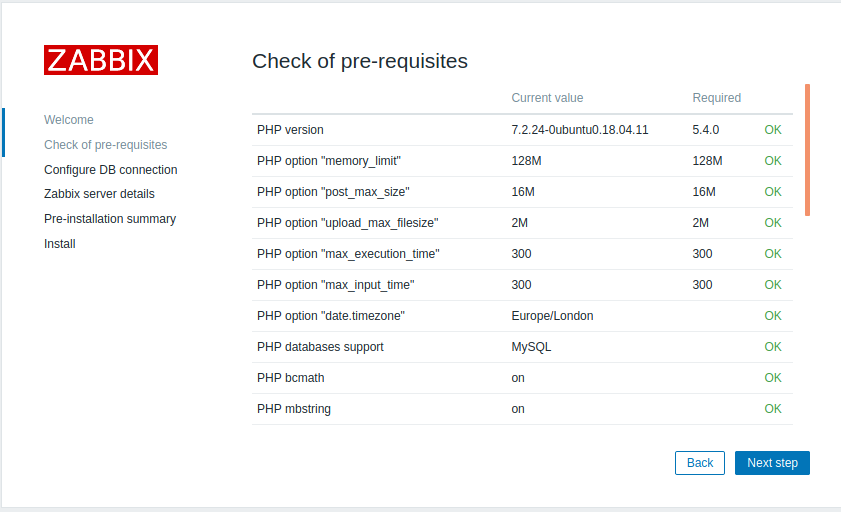

13. Ponemos el nombre de la base de datos, el usuario y la contraseña:


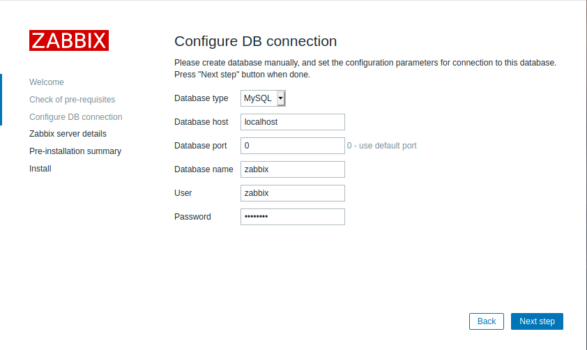

14. Indicamos el nombre de la base de datos:

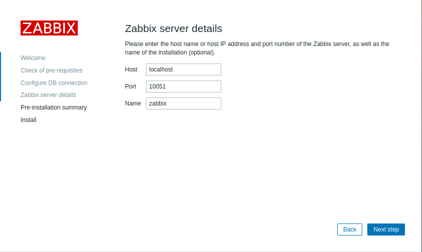

15. Y ya estaría instalado.

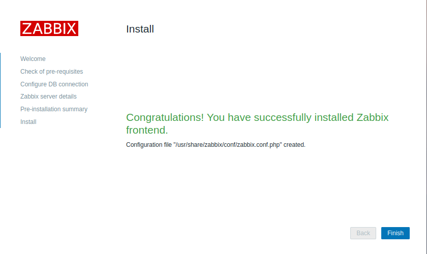

16. Ahora podemos iniciar sesión con el usuario “Admin” y la contraseña “zabbix”:

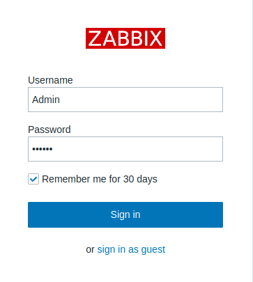