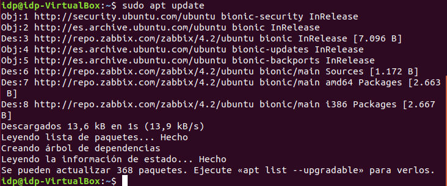

# Instalación de Zabbix en Ubuntu 18.04.

1. En una maquina con Ubuntu 18.04 instalado descargamos zabbix con el siguiente comando y lo instalamos:

```bash
wget https://repo.zabbix.com/zabbix/4.2/ubuntu/pool/main/z/zabbix-release/zabbix-release_4.2-1+bionic_all.deb 
```


```bash
sudo dpkg -i zabbix-release_4.2-1+bionic_all.deb 
```


2. Actualizamos los repositorios e instalamos el resto de paquetes necesarios para el servidor zabbix(esto último tardara un rato):

```bash
sudo apt update
```



```bash
sudo apt install -y zabbix-server-mysql zabbix-frontend-php zabbix-agent
```


3. Conectamos al servidor de bases de datos y creamos la base de datos:

```bash
sudo mysql -uroot -p
```


4. Creamos el usuario con su contraseña y le damos todos los privilegios sobre la base de datos:

```sql
	create database zabbix character set utf8 collate utf8_bin;
```

```sql
	grant all privileges on zabbix.* to zabbix@localhost identified by 'password';
```

