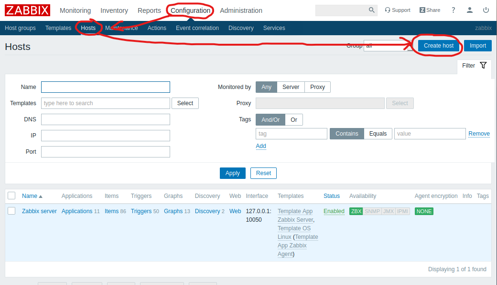
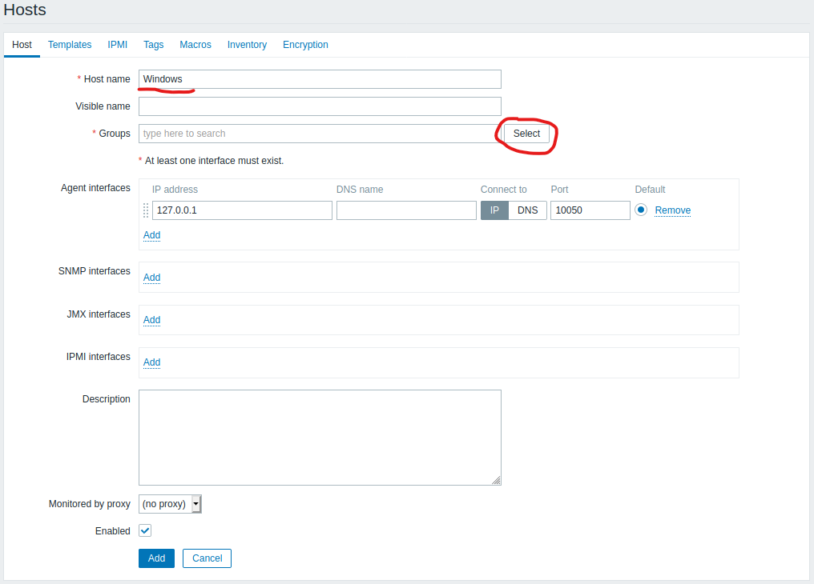
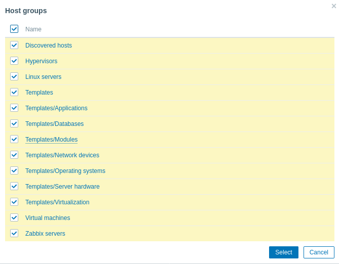
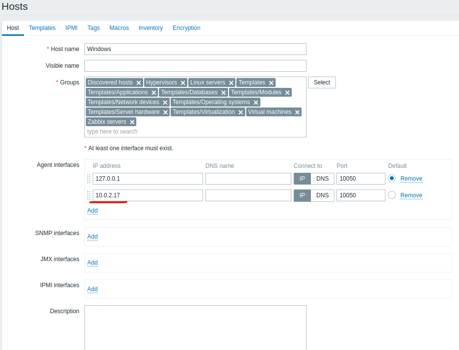
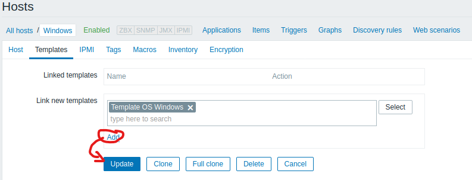
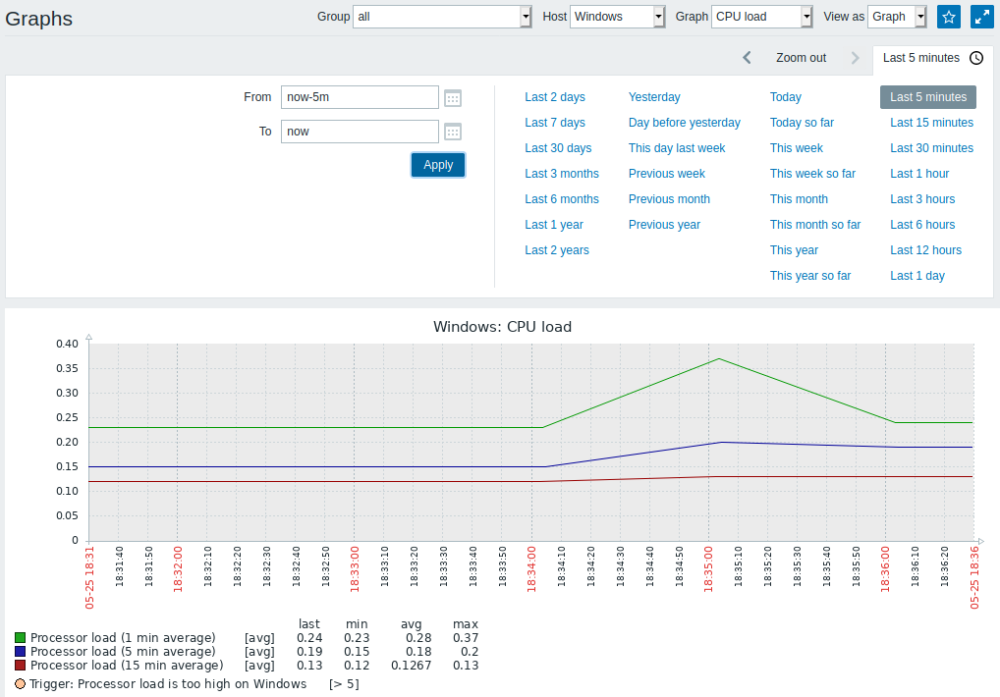
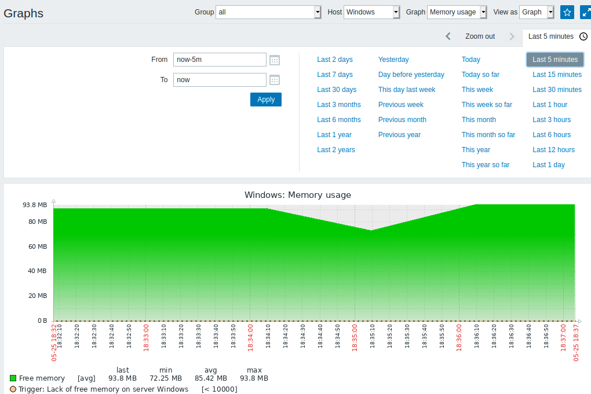

# Monitorización de un equipo.

1. Vamos al servidor, en el apartado de configuración vamos a hosts y creamos uno nuevo.

2. Dentro de aquí le ponemos el nombre que queramos y dentro de grupos seleccionamos todos los grupos. 

3. Debemos de poner la ip del equipo que vamos a monitorizar:

4. Ahora vamos a "Templates" y seleccionamos “OS Windows”. Tras esto damos pulsamos “add” y “Update”.

5. Aquí vemos la grafica de la cpu:

6. Y aquí tenemos la grafica de la memoria: 

