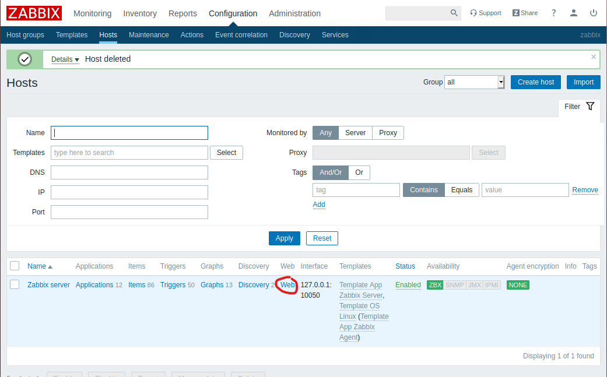
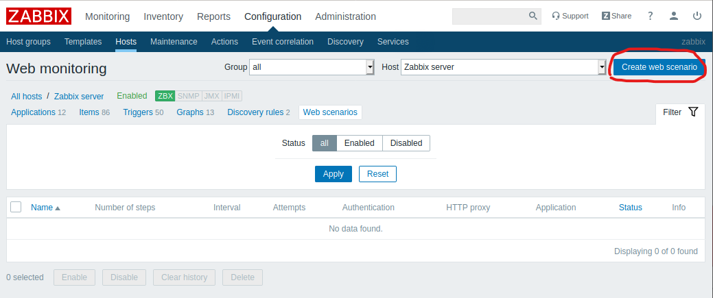
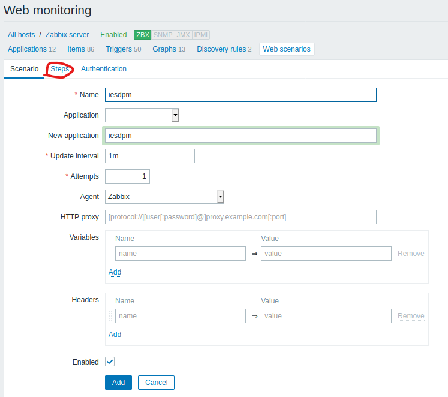
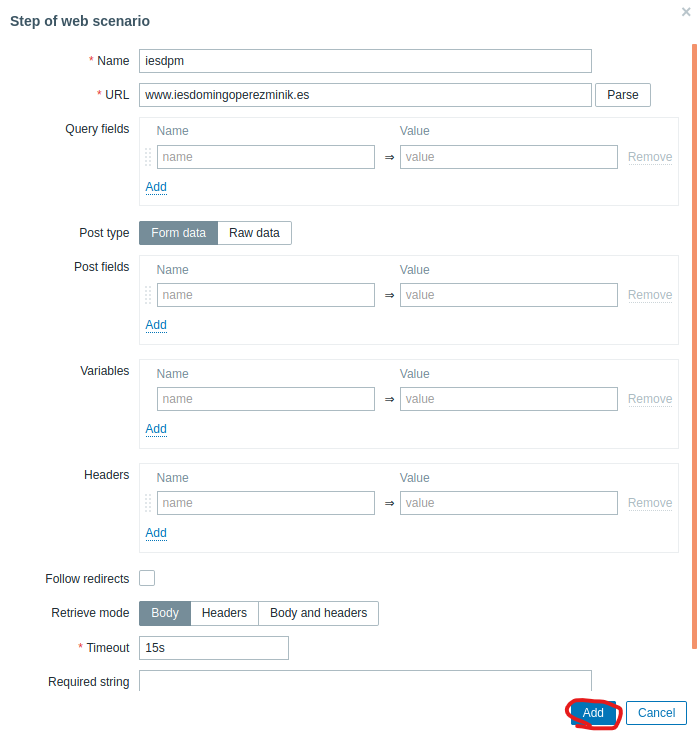
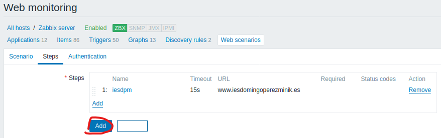
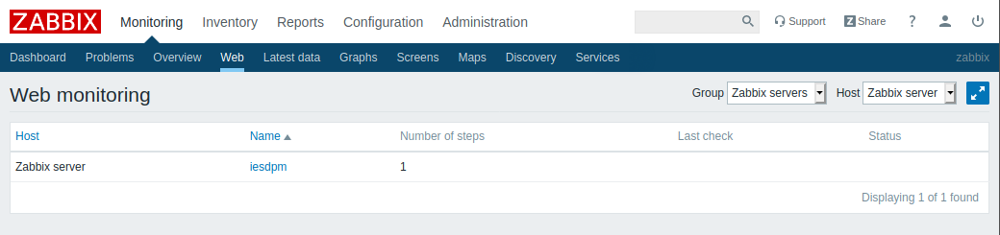
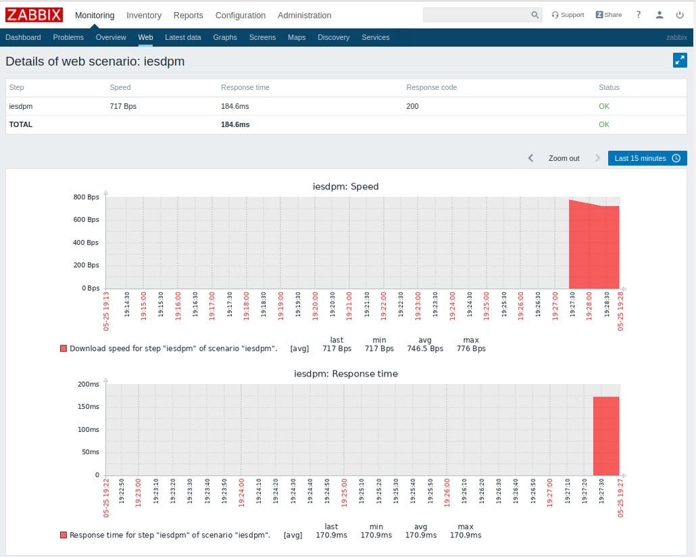

# Monotorización de un sitio web

1. Para monitorizar la página del instituto vamos a configuracion, hosts y en nuestro servidor clickamos en web.

2. Clickamos en "Create web scenario".

3. Ponemos el nombre y vamos a "steps".

4. Aquí ponemos la url de la página que queremos monitorizar, en este caso la del instituto.

5. Le damos a añadir de nuevo.

6. Ahora vamos a configuracion, web y vemos lo creado anteriormente. Entramos.	

7. Y aquí vemos la gráfica.

