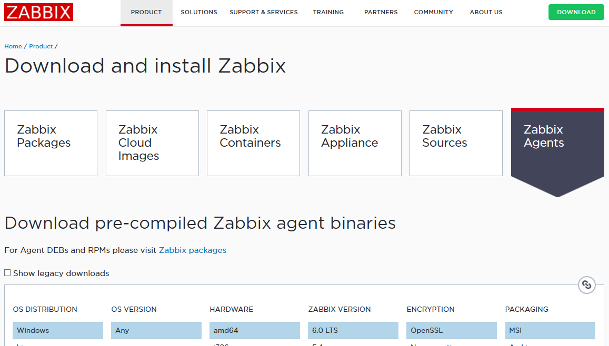
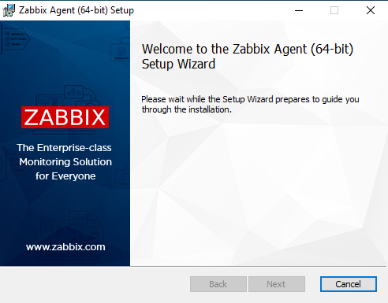
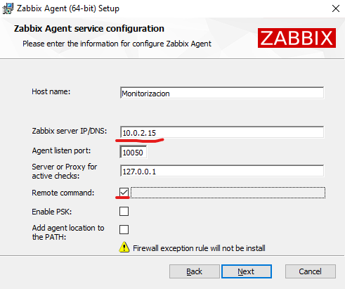
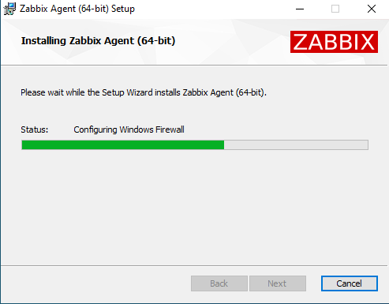
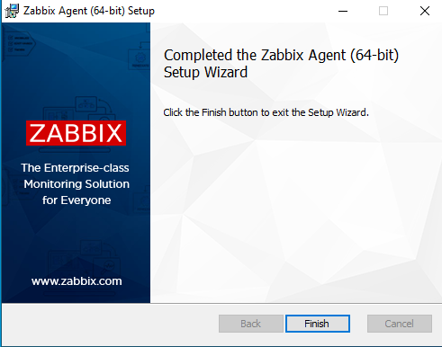

# Instalación de un servicio de monitorización.

1. Vamos a la página oficial de Zabbix y nos descargamos el agente de monitorización.

2. Una vez descargado ejecutamos el instalador.

3. En esta parte de la instalación pondremos la ip del servidor y marcamos la casilla de "Remote command".

